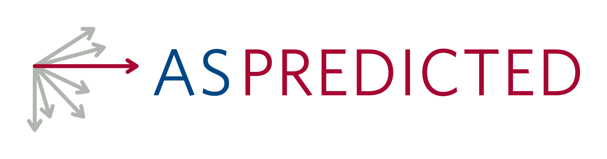
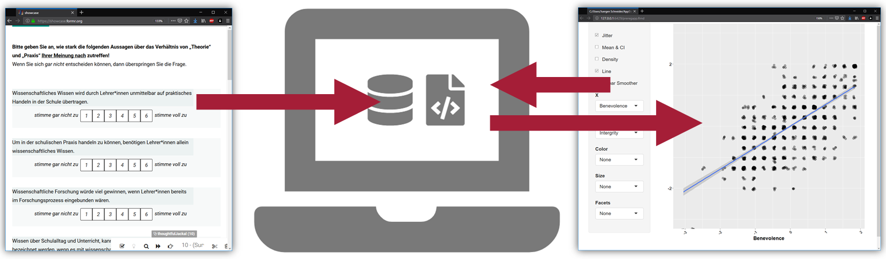
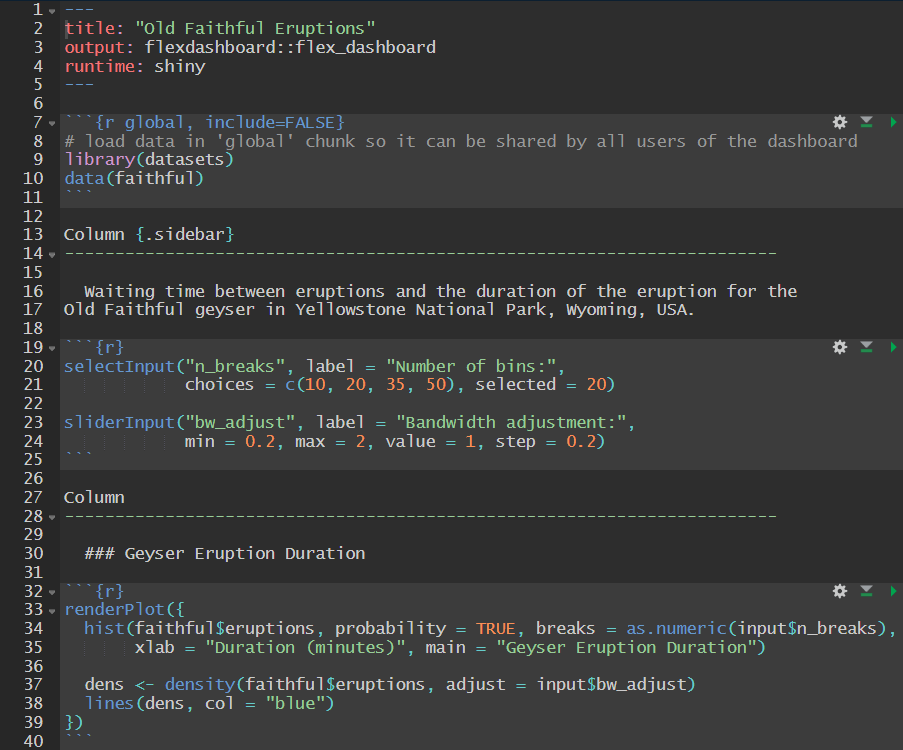
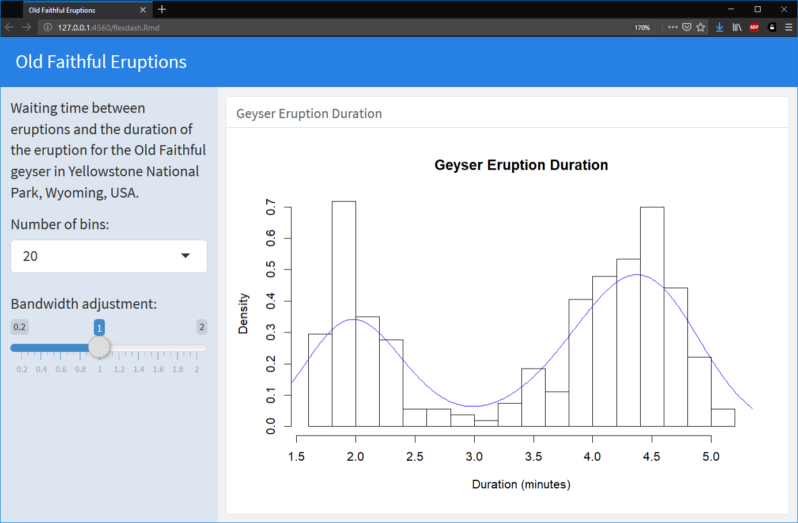

```{r setup, include=FALSE}
knitr::opts_chunk$set(echo = FALSE)
library(shiny)
```


# Why?

## Pre-Registration | aka specify prior to data collection

<br />
<br />
<br />

<div class = "container">
  <div class="margcent"></div>
  <div class="margcent"></div>
</div>

<div class="notes">
* we know why:
  + foster "Good Scientific Practice" (= avoid QRP)
  + help to avoid publication bias
</div>


## Pre-Registration | aka specify prior to data collection


<div class = "container2">
  <div class="boxfr big">`r icon(name="exclamation-circle", lib="font-awesome")`</div>
  <div class="boxar"></div>
  <div class="boxfr big">`r icon(name="clipboard-list", lib="font-awesome")`</div>
  <div class="boxar"></div>
  <div class="boxfr big">`r icon(name="database", lib="font-awesome")`</div>
  <div class="boxar"></div>
  <div class="boxfr big">`r icon(name="file-code", lib="font-awesome")`</div>
  <div class="boxar"></div>
  <div class="boxfr big">`r icon(name="comments", lib="font-awesome")`</div>
</div>

<div class = "container2">
  <div class="boxfr boxbg"><p class="semibig"><b>Hypotheses</b></p></div>
  <div class="boxar">`r icon(name="arrow-right", lib="font-awesome")`</div>
  <div class="boxfr boxbg"><p class="semibig"><b>Design</b></p></div>
  <div class="boxar">`r icon(name="arrow-right", lib="font-awesome")`</div>
  <div class="boxfr boxbg"><p class="semibig"><b>Data</b></p></div>
  <div class="boxar">`r icon(name="arrow-right", lib="font-awesome")`</div>
  <div class="boxfr boxbg"><p class="semibig"><b>Analyses</b></p></div>
  <div class="boxar">`r icon(name="arrow-right", lib="font-awesome")`</div>
  <div class="boxfr boxbg"><p class="semibig"><b>Dissemination</b></p></div>
</div>

<div class="notes">
* __Might include__
  + Hypotheses
  + Design
  + Sampling
  + Variables
  + Code of Analysis
* all we basically do is to shift the point in time WHEN we write down how we analyze our data
</div>


## Pre-Registration | aka specify prior to data collection

<div class = "container3">
  <div class="boxfr bigr"></div>
  <div class="boxar"></div>
  <div class="boxfr bigr"></div>
  <div class="boxar arrd">`r icon(name="caret-down", lib="font-awesome")`</div>
  <div class="boxfr big"></div>
  <div class="boxar"></div>
  <div class="boxfr bigr"></div>
  <div class="boxar"></div>
  <div class="boxfr big"></div>
</div>

<div class = "container2">
  <div class="boxfr bigr">`r icon(name="exclamation-circle", lib="font-awesome")`</div>
  <div class="boxar"></div>
  <div class="boxfr bigr">`r icon(name="clipboard-list", lib="font-awesome")`</div>
  <div class="boxar"></div>
  <div class="boxfr big">`r icon(name="database", lib="font-awesome")`</div>
  <div class="boxar"></div>
  <div class="boxfr bigr">`r icon(name="file-code", lib="font-awesome")`</div>
  <div class="boxar"></div>
  <div class="boxfr big">`r icon(name="comments", lib="font-awesome")`</div>
</div>

<div class = "container2">
  <div class="boxfr boxbg"><p class="semibig"><b>Hypotheses</b></p></div>
  <div class="boxar">`r icon(name="arrow-right", lib="font-awesome")`</div>
  <div class="boxfr boxbg"><p class="semibig"><b>Design</b></p></div>
  <div class="boxar">`r icon(name="arrow-right", lib="font-awesome")`</div>
  <div class="boxfr boxbg"><p class="semibig"><b>Data</b></p></div>
  <div class="boxar">`r icon(name="arrow-right", lib="font-awesome")`</div>
  <div class="boxfr boxbg"><p class="semibig"><b>Analyses</b></p></div>
  <div class="boxar">`r icon(name="arrow-right", lib="font-awesome")`</div>
  <div class="boxfr boxbg"><p class="semibig"><b>Dissemination</b></p></div>
</div>


<div class="notes">
so basically: we know how we'll analyze the data and it's all there except the data itself
</div>

## Pre-Registration | aka specify prior to data collection

<div class = "container3">
  <div class="boxfr bigr"></div>
  <div class="boxar"></div>
  <div class="boxfr bigr"></div>
  <div class="boxar arrd">`r icon(name="caret-down", lib="font-awesome")`</div>
  <div class="boxfr big"></div>
  <div class="boxar"></div>
  <div class="boxfr bigr"></div>
  <div class="boxar"></div>
  <div class="boxfr big"></div>
</div>

<div class = "container2">
  <div class="boxfr bigr">`r icon(name="exclamation-circle", lib="font-awesome")`</div>
  <div class="boxar"></div>
  <div class="boxfr bigr">`r icon(name="clipboard-list", lib="font-awesome")`</div>
  <div class="boxar"></div>
  <div class="boxfr big">`r icon(name="database", lib="font-awesome")`</div>
  <div class="boxar"></div>
  <div class="boxfr bigr">`r icon(name="file-code", lib="font-awesome")`</div>
  <div class="boxar"></div>
  <div class="boxfr big">`r icon(name="comments", lib="font-awesome")`</div>
</div>

<div class = "container2">
  <div class="boxfr boxbg"><p class="semibig"><b>Hypotheses</b></p></div>
  <div class="boxar">`r icon(name="arrow-right", lib="font-awesome")`</div>
  <div class="boxfr boxbg"><p class="semibig"><b>Design</b></p></div>
  <div class="boxar">`r icon(name="arrow-right", lib="font-awesome")`</div>
  <div class="boxfr boxbg"><p class="semibig"><b>Data</b></p></div>
  <div class="boxar">`r icon(name="arrow-right", lib="font-awesome")`</div>
  <div class="boxfr boxbg"><p class="semibig"><b>Analyses</b></p></div>
  <div class="boxar">`r icon(name="arrow-right", lib="font-awesome")`</div>
  <div class="boxfr boxbg"><p class="semibig"><b>Dissemination</b></p></div>
</div>

<div class = "container2">
  <div class="boxfr bigr"></div>
  <div class="boxar"></div>
  <div class="boxfr bigr"></div>
  <div class="boxar"></div>
  <div class="boxfr big"></div>
  <div class="boxar"></div>
  <div class="boxfr bigr"></div>
  <div class="boxar"></div>
  <div class="boxfr big"></div>
</div>


## `r paste(icon(name="copy", lib="font-awesome"), "Reproducible Reporting")` | aka what others see how knowledge came to be

<div class = "container2">
  <div class="boxfr big">`r icon(name="exclamation-circle", lib="font-awesome")`</div>
  <div class="boxar"></div>
  <div class="boxfr big">`r icon(name="clipboard-list", lib="font-awesome")`</div>
  <div class="boxar"></div>
  <div class="boxfr big">`r icon(name="database", lib="font-awesome")`</div>
  <div class="boxar"></div>
  <div class="boxfr big">`r icon(name="file-code", lib="font-awesome")`</div>
  <div class="boxar"></div>
  <div class="boxfr bigr">`r icon(name="comments", lib="font-awesome")`</div>
</div>

<div class = "container2">
  <div class="boxfr boxbg"><p class="semibig"><b>Hypotheses</b></p></div>
  <div class="boxar">`r icon(name="arrow-right", lib="font-awesome")`</div>
  <div class="boxfr boxbg"><p class="semibig"><b>Design</b></p></div>
  <div class="boxar">`r icon(name="arrow-right", lib="font-awesome")`</div>
  <div class="boxfr boxbg"><p class="semibig"><b>Data</b></p></div>
  <div class="boxar">`r icon(name="arrow-right", lib="font-awesome")`</div>
  <div class="boxfr boxbg"><p class="semibig"><b>Analyses</b></p></div>
  <div class="boxar">`r icon(name="arrow-right", lib="font-awesome")`</div>
  <div class="boxfr boxbg"><p class="semibig"><b>Dissemination</b></p></div>
</div>

<div class="notes">
  __purposes:__
  - replication
  - credibility
  - meta analyses
  
  Might move between a simple tet publication...
</div>

Source: Peng 2011


## `r paste(icon(name="copy", lib="font-awesome"), "Reproducible Reporting")` | aka what others see how knowledge came to be

<div class = "container2">
  <div class="boxfr big">`r icon(name="exclamation-circle", lib="font-awesome")`</div>
  <div class="boxar"></div>
  <div class="boxfr big">`r icon(name="clipboard-list", lib="font-awesome")`</div>
  <div class="boxar"></div>
  <div class="boxfr big">`r icon(name="database", lib="font-awesome")`</div>
  <div class="boxar"></div>
  <div class="boxfr big">`r icon(name="file-code", lib="font-awesome")`</div>
  <div class="boxar"></div>
  <div class="boxfr semibigr">`r icon(name="file-code", lib="font-awesome")` `r icon(name="comments", lib="font-awesome")`</div>
</div>

<div class = "container2">
  <div class="boxfr boxbg"><p class="semibig"><b>Hypotheses</b></p></div>
  <div class="boxar">`r icon(name="arrow-right", lib="font-awesome")`</div>
  <div class="boxfr boxbg"><p class="semibig"><b>Design</b></p></div>
  <div class="boxar">`r icon(name="arrow-right", lib="font-awesome")`</div>
  <div class="boxfr boxbg"><p class="semibig"><b>Data</b></p></div>
  <div class="boxar">`r icon(name="arrow-right", lib="font-awesome")`</div>
  <div class="boxfr boxbg"><p class="semibig"><b>Analyses</b></p></div>
  <div class="boxar">`r icon(name="arrow-right", lib="font-awesome")`</div>
  <div class="boxfr boxbg"><p class="semibig"><b>Dissemination</b></p></div>
</div>

<div class="notes">
  ... to publication plus the code of analyses
</div>

Source: Peng 2011


## `r paste(icon(name="copy", lib="font-awesome"), "Reproducible Reporting")` | aka what others see how knowledge came to be

<div class = "container2">
  <div class="boxfr big">`r icon(name="exclamation-circle", lib="font-awesome")`</div>
  <div class="boxar"></div>
  <div class="boxfr big">`r icon(name="clipboard-list", lib="font-awesome")`</div>
  <div class="boxar"></div>
  <div class="boxfr big">`r icon(name="database", lib="font-awesome")`</div>
  <div class="boxar"></div>
  <div class="boxfr big">`r icon(name="file-code", lib="font-awesome")`</div>
  <div class="boxar"></div>
  <div class="boxfr semibigr">`r icon(name="database", lib="font-awesome")` `r icon(name="file-code", lib="font-awesome")` `r icon(name="comments", lib="font-awesome")`</div>
</div>

<div class = "container2">
  <div class="boxfr boxbg"><p class="semibig"><b>Hypotheses</b></p></div>
  <div class="boxar">`r icon(name="arrow-right", lib="font-awesome")`</div>
  <div class="boxfr boxbg"><p class="semibig"><b>Design</b></p></div>
  <div class="boxar">`r icon(name="arrow-right", lib="font-awesome")`</div>
  <div class="boxfr boxbg"><p class="semibig"><b>Data</b></p></div>
  <div class="boxar">`r icon(name="arrow-right", lib="font-awesome")`</div>
  <div class="boxfr boxbg"><p class="semibig"><b>Analyses</b></p></div>
  <div class="boxar">`r icon(name="arrow-right", lib="font-awesome")`</div>
  <div class="boxfr boxbg"><p class="semibig"><b>Dissemination</b></p></div>
</div>

<div class="notes">
  ... to publication plus the code of analyses plus the data
</div>

Source: Peng 2011


## `r paste(icon(name="copy", lib="font-awesome"), "Reproducible Reporting")` | aka what others see how knowledge came to be

<div class = "container2">
  <div class="boxfr big">`r icon(name="exclamation-circle", lib="font-awesome")`</div>
  <div class="boxar"></div>
  <div class="boxfr big">`r icon(name="clipboard-list", lib="font-awesome")`</div>
  <div class="boxar"></div>
  <div class="boxfr big">`r icon(name="database", lib="font-awesome")`</div>
  <div class="boxar"></div>
  <div class="boxfr big">`r icon(name="file-code", lib="font-awesome")`</div>
  <div class="boxar"></div>
  <div class="boxfr semibigr">`r icon(name="database", lib="font-awesome")` `r icon(name="file-code", lib="font-awesome")` `r icon(name="comments", lib="font-awesome")`</div>
</div>

<div class = "container2">
  <div class="boxfr boxbg"><p class="semibig"><b>Hypotheses</b></p></div>
  <div class="boxar">`r icon(name="arrow-right", lib="font-awesome")`</div>
  <div class="boxfr boxbg"><p class="semibig"><b>Design</b></p></div>
  <div class="boxar">`r icon(name="arrow-right", lib="font-awesome")`</div>
  <div class="boxfr boxbg"><p class="semibig"><b>Data</b></p></div>
  <div class="boxar">`r icon(name="arrow-right", lib="font-awesome")`</div>
  <div class="boxfr boxbg"><p class="semibig"><b>Analyses</b></p></div>
  <div class="boxar">`r icon(name="arrow-right", lib="font-awesome")`</div>
  <div class="boxfr boxbg"><p class="semibig"><b>Dissemination</b></p></div>
</div>

<div class = "container2">
  <div class="boxfr bigr"></div>
  <div class="boxar"></div>
  <div class="boxfr bigr"></div>
  <div class="boxar"></div>
  <div class="boxfr big"></div>
  <div class="boxar"></div>
  <div class="boxfr bigr"></div>
  <div class="boxar"></div>
  <div class="boxfr big" style="padding-top:15px;"></div>
</div>

<div class="notes">
  Such reproducible reports are normally created after data collection and analyses
  and give us an impression of "how knowledge came to be"
</div>

Source: Peng 2011


## `r paste(icon(name="wifi", lib="font-awesome"), "Live-Streaming Knowledge Crystalization")` | via Dashboards

<div class = "container2">
  <div class="boxfr big">`r icon(name="exclamation-circle", lib="font-awesome")`</div>
  <div class="boxar"></div>
  <div class="boxfr big">`r icon(name="clipboard-list", lib="font-awesome")`</div>
  <div class="boxar"></div>
  <div class="boxfr bigr">`r icon(name="database", lib="font-awesome")`</div>
  <div class="boxar"></div>
  <div class="boxfr big">`r icon(name="file-code", lib="font-awesome")`</div>
  <div class="boxar"></div>
  <div class="boxfr big">`r icon(name="comments", lib="font-awesome")`</div>
</div>

<div class = "container2">
  <div class="boxfr boxbg"><p class="semibig"><b>Hypotheses</b></p></div>
  <div class="boxar">`r icon(name="arrow-right", lib="font-awesome")`</div>
  <div class="boxfr boxbg"><p class="semibig"><b>Design</b></p></div>
  <div class="boxar">`r icon(name="arrow-right", lib="font-awesome")`</div>
  <div class="boxfr boxbg"><p class="semibig"><b>Data</b></p></div>
  <div class="boxar">`r icon(name="arrow-right", lib="font-awesome")`</div>
  <div class="boxfr boxbg"><p class="semibig"><b>Analyses</b></p></div>
  <div class="boxar">`r icon(name="arrow-right", lib="font-awesome")`</div>
  <div class="boxfr boxbg"><p class="semibig"><b>Dissemination</b></p></div>
</div>

<div class = "container3" style="height:10px">
  <div style="width: 47%; text-align:right;"></div>
  <div style="width: 6%;"></div>
  <div style="width: 47%; text-align:left;"></div>
</div>

<div class = "container2">
  <div class="boxfr" style="width:33%"></div>
  <div class="boxfr bigr">`r icon(name="file-code", lib="font-awesome")`</div>
  <div style="width: 2%; color: #b44d50;"><br />`r icon(name="arrow-right", lib="font-awesome")`</div>
  <div class="boxfr bigr">`r icon(name="comments", lib="font-awesome")`</div>
  <div class="boxfr" style="width:33%"></div>
</div>

<div class = "container2">
  <div class="boxfr" style="width:33%"></div>
  <div class="boxfr boxbg"><p class="semibig"><b>Analyses</b></p></div>
  <div style="width: 2%;"></div>
  <div class="boxfr boxbg"><p class="semibig"><b>Dissemination</b></p></div>
  <div class="boxfr" style="width:33%"></div>
</div>

<div class="notes">
but why are we waiting to disseminate our study until data collection is finished?
it's all there
- analyses code
- possible data presentation
</div>


# How?

##  R Markdown | general idea

With R Markdown we can...

* use a markup language with simple syntax
* and interweave 
  + `r icon(name="comments", lib="font-awesome")` narratives
  + `r icon(name="database", lib="font-awesome")` data/ files
  + `r icon(name="file-code", lib="font-awesome")` code
  + `r icon(name="chart-bar", lib="font-awesome")` output via `knitr` and `pandoc`
* into multiple different file types (.html, .pdf, .docx, pptx, ...)


## {data-background=webs/rmd_ex.png data-background-size=contain}


##  Interactive Reporting | general idea

* static reports ideal for linear storys
* but what if we want to allow
  + data exploration (e.g. by recipients)
  + flexible (live streamed) data presentation

`r icon(name="arrow-right", lib="font-awesome")` interactive reporting

<div class = "container">
  <div class="margcent1" style="width:90%;"></div>
</div>


##  Flexdashboard for R
with this bit of code<br />
<div style="text-align:center;">

</div>

##  Flexdashboard for R
you can create this interactive app<br />
<div style="text-align:center;">

</div>

##  Flexdashboard for R

<br />
<br />

* combindes the advantages of

<div class = "container">
  <div class="margcent1" style="width:80%; vertical-align:middle;">  </div>
</div>

* easy-to-use templates
* many integrated widgets
* browser interpretable

<div class = "notes">
markdown-based document
establish interactivity via shiny-runtime
</div>

# Example!